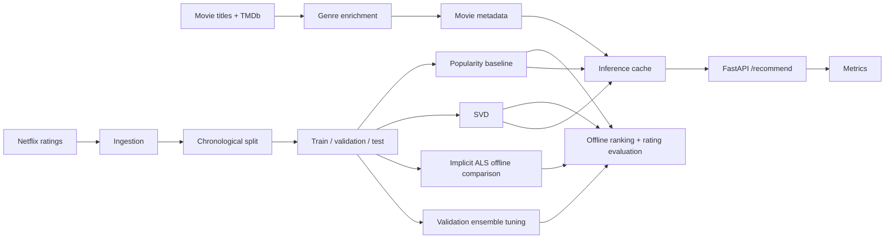

# Netflix Movie Recommendation Engine — 2.2

A classical collaborative-filtering recommendation system built around the Netflix Prize ratings dataset. The project focuses on **temporal-leakage-safe offline evaluation, efficient SVD inference, ranking evaluation, reproducible artifacts, CI quality gates, and lightweight API serving**.

No LLM, RAG, generative AI, vector database, or other unrelated AI component is used.

## Architecture



## What is implemented

- Chronological train/validation/test splitting.
- User/movie activity filtering computed from the training period only.
- Explicit-rating SVD for the serving model.
- Most Popular and rating-popularity baselines.
- ALS retained as an **implicit-feedback offline comparison**, not as an explicit-rating predictor.
- Precision@K, Recall@K, NDCG@K, catalog coverage, and genre-based diversity.
- RMSE/MAE kept separate from ranking metrics.
- Deterministic negative sampling for top-N evaluation.
- FastAPI recommendation inference offloaded to a threadpool so synchronous ML code does not block the event loop.
- API-key authentication when configured, process-local rate limiting, and explicit CORS allowlisting.
- Artifact metadata containing parameter/data hashes, dataset/model versions, project version, and Git commit when available.
- CI linting, formatting, type checking, tests, and a reproducible model-quality regression gate.
- Docker build and inference smoke-test workflow.
- Lightweight concurrent load-test script.
- Prometheus metrics for HTTP requests, latency, inference errors, recommendation counts, and model/data loading.

## Evaluation methodology

### Rating prediction

RMSE and MAE are measured on the chronological held-out test period. Models evaluated in this category are the global mean, rating-popularity baseline, SVD, and the SVD/popularity blend.

### Ranking

For ranking evaluation, a test interaction with `Rating >= 4` is treated as relevant. Candidates come only from the training catalog, items already seen by the user in training are removed, and deterministic sampled negatives are added. Metrics are averaged over users with at least one eligible relevant test item.

The **Most Popular** baseline ranks movies by training-period interaction count. Catalog coverage measures the fraction of the candidate catalog that appears in evaluated recommendation lists. Genre diversity is an average pairwise Jaccard-distance complement over recommendation genres.

This methodology does not use validation/test interactions to define the training catalog or activity filters.

## ALS rationale

`implicit` ALS expects implicit preference strength rather than treating 1–5 ratings as direct regression targets. The implementation therefore converts training ratings into positive-confidence interactions and evaluates ALS only as an offline top-N ranking model. It is not part of the FastAPI serving path and no ALS RMSE/MAE claim is made.

## Reproducibility and versioning

Model artifacts are accompanied by `*.metadata.json` files containing:

- project version
- deterministic parameter hash
- dataset hash/version
- model version
- Git commit when available
- creation timestamp
- artifact hash (lightweight integrity check)

Run:

```bash
make version
```

After generating data and training, the metadata files identify the exact input hashes and model configuration used to create each artifact. The local `mlruns/` directory is an experiment-tracking store; it is **not** presented as a production model registry.

## Artifact integrity and security

Model artifacts are stored as pickle files, which can execute arbitrary code when loaded. To ensure safety:

- **Artifact trust boundary**: Model artifacts must be treated as trusted inputs
- **Application-controlled paths**: Artifact loading only occurs from application-controlled directories (`artifacts/`)
- **Integrity validation**: Artifact files include lightweight integrity hashes in their metadata to detect accidental corruption
- **Freshness validation**: Artifact loading includes metadata validation to ensure compatibility with current code and data

**Important**: Never load pickle files from untrusted sources. The application's artifact loading functions (`get_or_train_*`) should be used instead of direct pickle loading to ensure proper validation.

## Setup

Python 3.11–3.13 is the primary tested range. The full Netflix pipeline is memory-intensive; 16 GB RAM is a practical minimum for working with the complete dataset.

```bash
python -m venv .venv
source .venv/bin/activate
python -m pip install -r requirements.txt
python -m pip install -r requirements-dev.txt
cp .env.example .env
```

Set `TMDB_API_KEY` only when genre enrichment needs to query TMDb.

## Pipeline

```bash
make ingest
make enrich
make split
make train
make evaluate
```

Or:

```bash
make all
```

The raw Netflix files are not committed because of their size. The repository also does not commit generated datasets, model binaries, or MLflow runtime data.

## Serving

Local FastAPI:

```bash
make serve-api
```

Then open `/docs` or call:

```bash
curl -X POST http://localhost:8000/recommend \
  -H 'Content-Type: application/json' \
  -d '{"user_id":"2336536","top_n":5}'
```

Set `API_KEY` in `.env` to require `X-API-Key` authentication. `CORS_ALLOW_ORIGINS` accepts a comma-separated allowlist. The default rate limit is 60 requests per 60 seconds per process/client address.

For local development the API key can remain unset. For multi-worker or distributed deployment, the process-local limiter should be replaced with shared infrastructure; that is deliberately outside this portfolio project's scope.

Gradio remains available locally:

```bash
make serve-gradio
```

It does not create a public share URL by default.

## Docker

Build:

```bash
make docker-build
```

Run:

```bash
cp .env.example .env
make docker-run
```

The service expects prepared `data/` and `artifacts/` directories. CI creates a small deterministic runtime fixture and exercises `/health`, `/ready`, and authenticated `/recommend`.

## CI and quality gate

CI runs:

```text
flake8 src scripts tests
black --check --diff src scripts tests
mypy src scripts --config-file mypy.ini
pytest tests/ -v
python scripts/run_quality_gate.py
Docker build + smoke test
```

The quality gate trains the configured SVD on a small chronological fixture and checks that it improves on the same fixture's global-mean rating baseline by configured relative margins. This is a **regression contract for the implementation**, not a claim that the fixture represents Netflix-scale model quality.

## Load testing

Start the API first, then run:

```bash
python scripts/load_test.py \
  --url http://localhost:8000/recommend \
  --requests 100 \
  --concurrency 10 \
  --user-id 2336536
```

If API authentication is enabled, add `--api-key "$API_KEY"`.

The script reports request count, concurrency, throughput, success rate, mean latency, p50, p95, and p99. Benchmark numbers are intentionally not committed unless they were measured against a reproducible runtime.

## Repository layout

```text
.
├── .github/workflows/ci.yml
├── artifacts/                 # generated model artifacts, not committed
├── data/                     # raw/processed data, not committed
├── notebooks/
├── scripts/
├── src/
│   ├── data/
│   ├── evaluation/
│   ├── inference/
│   ├── models/
│   └── serving/
├── tests/
├── Dockerfile
├── docker-compose.yml
├── Makefile
├── requirements.txt
├── requirements-dev.txt
└── README.md
```

## Limitations / future production considerations

This is a portfolio-scale recommender system, not a claim of Netflix-scale production readiness. Known limitations include a static historical dataset, local artifact storage, process-local rate limiting, no distributed serving layer, and no production artifact registry. Those concerns are documented rather than hidden behind additional infrastructure.

The current serving model is also deliberately simple: SVD predictions are blended with rating-popularity and popularity is used for cold-start users. A production system would require a continuously refreshed interaction stream, retraining policy, online/offline monitoring, shared rate limiting, durable model storage, and deployment controls.
