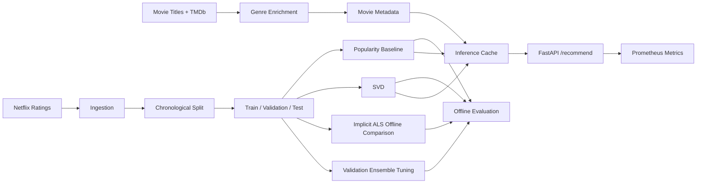

# Netflix Movie Recommendation Engine — 2.2

[](https://github.com/offbeatash/Netflix-movie-recommendation-engine/actions/workflows/ci.yml)

> A production-oriented movie recommendation system built on the Netflix Prize ratings dataset, combining **SVD collaborative filtering, popularity-based cold-start recommendations, ranking evaluation, MLflow experiment tracking, automated CI, Docker, FastAPI, and Hugging Face deployment.**

### 🚀 Live Demo

**Try the deployed recommendation engine:**
https://huggingface.co/spaces/offbeat-ash/netflix-recommendation-engine

The public demo uses pretrained model artifacts and does not retrain the recommendation model at runtime.

---

## Overview

This project takes a classical recommendation-system approach and builds it into a complete ML engineering pipeline.

The system covers the workflow from raw historical ratings to model training, offline evaluation, artifact versioning, API serving, testing, containerization, and public deployment.

The primary serving model is an **SVD collaborative-filtering model blended with a rating-popularity baseline**. Popularity-based recommendations provide a fallback for cold-start users.

The project intentionally focuses on **classical recommender-system engineering rather than LLM/RAG-based recommendations**.

### What the system demonstrates

* Collaborative filtering with matrix-factorization-based SVD
* Popularity and rating-popularity baselines
* Cold-start handling
* Chronological, leakage-safe evaluation
* Rating prediction and top-N ranking evaluation
* Deterministic negative sampling
* Model/artifact versioning and integrity validation
* MLflow experiment tracking
* FastAPI model serving
* Gradio interface
* Dockerized deployment
* Prometheus metrics
* Automated CI quality gates
* Concurrent API load testing
* Hugging Face deployment using pretrained artifacts

---

## Architecture


```mermaid
flowchart LR
    A[Netflix Ratings] --> B[Ingestion]
    M[Movie Titles + TMDb] --> C[Genre Enrichment]

    B --> D[Chronological Split]
    C --> E[Movie Metadata]

    D --> F[Train / Validation / Test]

    F --> G[Popularity Baseline]
    F --> H[SVD]
    F --> I[Implicit ALS Offline Comparison]

    F --> J[Validation Ensemble Tuning]

    G --> K[Offline Evaluation]
    H --> K
    I --> K
    J --> K

    G --> L[Inference Cache]
    H --> L
    E --> L

    L --> N[FastAPI /recommend]
    N --> O[Prometheus Metrics]
```

### Deployment architecture

The production-style application and the public demo are intentionally separated.

```text
Production Application
────────────────────────────────────────────

FastAPI
   ↓
Recommendation Inference
   ↓
SVD + Popularity Ensemble
   ↓
Pretrained Artifacts
   ↓
Docker / Local Deployment


Hugging Face Demo
────────────────────────────────────────────

Gradio
   ↓
HF Serving Adapter
   ↓
Pretrained SVD + Popularity Artifacts
   ↓
Hugging Face Spaces
```

This separation keeps the public deployment lightweight while preserving the more complete production-oriented application structure in the main repository.

---

# Recommendation System

## 1. Collaborative Filtering — SVD

The primary recommendation model uses **Singular Value Decomposition (SVD)** for explicit-rating collaborative filtering.

The model learns latent representations of users and movies from historical ratings and predicts user–movie preferences.

SVD is used for the primary recommendation path and is combined with a popularity-based signal during inference.

---

## 2. Popularity Baselines

Two popularity-based approaches are implemented:

* **Most Popular** — ranks movies using training-period interaction counts.
* **Rating Popularity** — incorporates rating information while applying the configured rating-count qualification threshold.

Popularity models serve two purposes:

1. Establish simple baselines for evaluation.
2. Provide recommendations when collaborative-filtering information is unavailable, particularly for cold-start users.

---

## 3. SVD + Popularity Ensemble

The serving recommendation path combines:

```text
SVD predictions
        +
Rating-popularity signal
        ↓
Ensemble ranking
        ↓
Top-N recommendations
```

For known users, the system uses collaborative-filtering predictions together with popularity information.

For cold-start users, the system falls back to popularity-based recommendations.

Previously seen movies are excluded from the recommendation list.

---

## ALS: Offline Comparison

`implicit` ALS is included as an **offline top-N ranking comparison**.

ALS expects implicit preference/confidence signals rather than treating 1–5 ratings as direct regression targets. Therefore, the training ratings are converted into positive-confidence interactions for ALS.

ALS is **not part of the serving path**.

No ALS RMSE/MAE claim is made because the model is being used for implicit-feedback ranking rather than explicit-rating regression.

---

# Evaluation

The evaluation framework separates **rating prediction** from **recommendation ranking**.

This prevents metrics designed for different objectives from being mixed together.

## Rating Prediction

The following metrics are evaluated on the chronological held-out test period:

* RMSE
* MAE

Models evaluated include:

* Global mean
* Rating-popularity baseline
* SVD
* SVD + popularity blend

Inactive/cold users and movies are filtered from the validation and test sets before rating evaluation.

Therefore, these RMSE/MAE measurements represent **warm-start performance**, not cold-start performance.

---

## Ranking Evaluation

For top-N evaluation:

```text
Rating >= 4
      ↓
Relevant test interaction
```

The ranking evaluation measures:

* Precision@K
* Recall@K
* NDCG@K
* Catalog coverage
* Genre-based diversity

Candidates are taken from the training catalog.

The evaluation excludes:

* Movies already seen by the user during training
* Relevant test items from the sampled-negative pool

Deterministic sampled negatives are then added.

Because sampled negatives may include movies that the user rated poorly during the test period, this is a **sampled-negative evaluation protocol**, not a strict unseen-item evaluation.

Metrics are averaged across users with at least one eligible relevant test item.

---

## Catalog Coverage

Catalog coverage measures the fraction of the candidate movie catalog that appears in evaluated recommendation lists.

This provides a view of how broadly the recommendation system uses the available catalog rather than repeatedly recommending only a small set of popular movies.

---

## Genre Diversity

Genre diversity is calculated using the pairwise Jaccard-distance complement over recommendation genres.

This provides an additional view of recommendation variety beyond relevance metrics.

---

## Leakage Prevention

The evaluation pipeline is designed to prevent future information from leaking into training-time decisions.

In particular:

* Data is split chronologically.
* User/movie activity filtering is computed from the training period.
* Training catalogs are derived from training data.
* Validation/test interactions are not used to define training activity filters.
* Negative sampling is deterministic.

This makes the offline evaluation protocol reproducible and temporally consistent.

---

# Rating-Count Thresholds

Two different thresholds are used for different pipeline stages.

### `MIN_RATINGS_COUNT=500`

Used by the popularity model to determine whether a movie has enough training-period ratings to qualify for the popularity baseline.

### `min_movie_rating=50`

Used during feature construction to determine whether a movie has sufficient activity for inclusion in the constructed catalog/features.

These thresholds intentionally serve different purposes and are therefore not interchangeable.

---

# Production Engineering

The project goes beyond model training and includes several production-oriented components.

### Artifact Management

Generated model artifacts are accompanied by `*.metadata.json` files containing information such as:

* Project version
* Deterministic parameter hash
* Dataset hash/version
* Model version
* Git commit when available
* Creation timestamp
* Artifact integrity hash

This makes it possible to trace an artifact back to its configuration and source data.

### MLflow

MLflow is used for experiment tracking.

The local `mlruns/` directory acts as an experiment-tracking store and is **not presented as a production model registry**.

### Inference Cache

Frequently used recommendation data can be loaded into an inference cache to avoid repeatedly performing expensive preparation work.

### FastAPI

FastAPI exposes the recommendation system through an HTTP API.

Synchronous ML inference is offloaded to a threadpool so it does not block the asynchronous API event loop.

### Prometheus Metrics

The application exposes metrics covering areas such as:

* HTTP requests
* Request latency
* Inference errors
* Recommendation counts
* Model loading
* Data loading

### Security Controls

The API supports:

* Optional API-key authentication
* Explicit CORS allowlisting
* Process-local request rate limiting

The default rate limit is:

```text
60 requests / 60 seconds
```

per process/client address.

---

# Hugging Face Deployment

The project includes an isolated deployment layer for the public Hugging Face demo.


The Hugging Face layer uses **pretrained artifacts only**.

The public application does not retrain the model.

The deployment adapter is isolated from the main production configuration so that the lightweight public application does not need to import the complete production runtime.

### Cold-start behavior

```text
Known user
   ↓
SVD + Popularity Ensemble
   ↓
Top-N Recommendations


Unknown user
   ↓
Popularity Baseline
   ↓
Top-N Recommendations
```

The deployed system excludes movies that the user has already seen when generating recommendations.

---

# Artifact Integrity & Security

The model artifacts are stored as pickle files.

Pickle files can execute arbitrary code when loaded, so artifacts must be treated as **trusted inputs**.

The application therefore follows these principles:

* Artifact loading is restricted to application-controlled paths.
* Artifacts are validated against their metadata.
* Integrity hashes help detect accidental corruption.
* Artifact freshness is checked against the expected project/data configuration.

The repository intentionally does **not** commit large raw datasets or trained model binaries.

> **Important:** Never load pickle files obtained from an untrusted source.

---

# Dataset & Artifacts

The complete dataset and required generated artifacts are distributed separately from the Git repository.

**Dataset & Artifacts:**
https://drive.google.com/drive/folders/1eldCFc5M0ElypZ9fU_jz4OpXD_-AQEUi?usp=sharing

Place downloaded files into the corresponding:

```text
data/
artifacts/
```

directories.

The repository intentionally excludes:

* Large raw datasets
* Generated datasets
* Trained model binaries
* MLflow runtime data

---

# Setup

The primary tested Python range is:

```text
Python 3.10 – 3.14
```

The complete Netflix pipeline is memory-intensive. Approximately **16 GB RAM is a practical minimum** for working with the full dataset.

## Installation

```bash
python -m venv .venv
```

### Linux / macOS

```bash
source .venv/bin/activate
```

### Windows

```powershell
.venv\Scripts\Activate.ps1
```

Install dependencies:

```bash
python -m pip install -r requirements.txt
python -m pip install -r requirements-dev.txt
python -m pip install -e .
```

Create the environment file:

```bash
cp .env.example .env
```

Set:

```text
TMDB_API_KEY=your_api_key
```

only when genre enrichment requires TMDb access.

---

# Running the Pipeline

The complete pipeline is divided into reproducible stages.

### 1. Ingestion

```bash
make ingest
```

or:

```bash
python scripts/run_ingest.py
```

### 2. Genre enrichment

```bash
make enrich
```

or:

```bash
python scripts/run_enrich_genres.py
```

### 3. Feature construction / chronological split

```bash
make split
```

or:

```bash
python scripts/run_build_features.py
```

### 4. Model training

```bash
make train
```

or:

```bash
python scripts/run_train.py
```

### 5. Evaluation

```bash
make evaluate
```

or:

```bash
python scripts/run_evaluate.py
```

### 6. Quality gate

```bash
make quality-gate
```

or:

```bash
python scripts/run_quality_gate.py
```

### 7. Version information

```bash
make version
```

or:

```bash
python scripts/run_version.py
```

### Run the complete pipeline

```bash
make all
```

---

# Serving

## Gradio

Run the local Gradio interface:

```bash
make serve-gradio
```

The local Gradio server does not create a public share URL by default.

---

## FastAPI

Start the API:

```bash
make serve-api
```

or:

```bash
python src/serving/api.py
```

API documentation is available at:

```text
http://localhost:8000/docs
```

### Recommendation request

```bash
curl -X POST http://localhost:8000/recommend \
  -H "Content-Type: application/json" \
  -d '{"user_id":"2336536","top_n":5}'
```

### API authentication

Set:

```text
API_KEY=your_key
```

in `.env` to enable `X-API-Key` authentication.

CORS origins can be configured using:

```text
CORS_ALLOW_ORIGINS
```

as a comma-separated allowlist.

For local development, the API key may remain unset.

> The current rate limiter and inference cache are process-local. Multi-worker or distributed deployment would require shared infrastructure.

---

# Docker

The application can be built and run using Docker.

```bash
docker compose up --build
```

The CI pipeline also performs a Docker build and inference smoke test.

---

# CI & Quality Gates

The repository uses automated CI checks covering:

```text
Flake8
Black
Mypy
Pytest
Model-quality regression gate
Docker build
Inference smoke test
```

The equivalent local checks are:

```bash
python -m black --check --diff src scripts tests

python -m flake8 src scripts tests

python -m mypy src scripts --config-file mypy.ini

python -m pytest

python scripts/run_quality_gate.py
```

The quality gate trains the configured SVD model on a small chronological fixture and verifies that it improves against the fixture's global-mean rating baseline according to configured relative margins.

This is an **implementation regression contract**, not a claim that the fixture represents Netflix-scale model quality.

---

# Load Testing

Start the API and run:

```bash
python scripts/load_test.py \
  --url http://localhost:8000/recommend \
  --requests 100 \
  --concurrency 10 \
  --user-id 2336536
```

If authentication is enabled:

```bash
python scripts/load_test.py \
  --url http://localhost:8000/recommend \
  --requests 100 \
  --concurrency 10 \
  --user-id 2336536 \
  --api-key "$API_KEY"
```

The script reports:

* Request count
* Concurrency
* Throughput
* Success rate
* Mean latency
* p50 latency
* p95 latency
* p99 latency

Benchmark numbers are intentionally not hard-coded into the README unless they are measured against a reproducible runtime.

---

# Reproducibility & Versioning

Run:

```bash
make version
```

Generated artifacts contain metadata describing the configuration used to produce them.

The metadata can include:

```text
Project version
Parameter hash
Dataset hash/version
Model version
Git commit
Creation timestamp
Artifact hash
```

This provides a traceable connection between:

```text
Data
 ↓
Configuration
 ↓
Training
 ↓
Artifact
 ↓
Serving
```

---

# Repository Structure

```text
.
├── .github/
│   └── workflows/
│       └── ci.yml
│
├── artifacts/                  # generated model artifacts
├── data/                       # raw / processed data
├── notebooks/                  # exploration and analysis
├── scripts/                    # pipeline and utility scripts
│
├── src/
│   ├── data/                   # ingestion and feature preparation
│   ├── evaluation/             # rating and ranking evaluation
│   ├── inference/              # recommendation inference
│   ├── models/                 # SVD, popularity, ALS
│   └── serving/                # FastAPI, monitoring, serving logic
│
├── tests/                      # automated tests
│
├── Dockerfile
├── docker-compose.yml
├── Makefile
├── requirements.txt
├── requirements-dev.txt
└── README.md
```

Generated data, model binaries, and runtime artifacts are intentionally excluded from Git.

---

# Limitations & Future Production Considerations

This is a **portfolio-scale recommender system**, not a claim of Netflix-scale production readiness.

Current limitations include:

* Static historical dataset
* Local artifact storage
* Process-local inference cache
* Process-local rate limiting
* No distributed serving layer
* No production artifact registry
* No continuously refreshed interaction stream

A larger production system would require additional infrastructure for:

* Continuous interaction ingestion
* Scheduled or triggered retraining
* Online/offline model monitoring
* Shared caching
* Distributed rate limiting
* Durable model storage
* Deployment controls
* Continuous data-quality monitoring

The current system deliberately keeps those concerns outside the scope of this portfolio project while implementing the core engineering patterns needed to extend it.

---

# Technology Stack

| Area                | Technologies                             |
| ------------------- | ---------------------------------------- |
| Language            | Python                                   |
| Data Processing     | Pandas, NumPy                            |
| Recommendation      | SVD, Popularity Models, ALS              |
| Machine Learning    | scikit-learn / Surprise-based components |
| Evaluation          | RMSE, MAE, Precision@K, Recall@K, NDCG@K |
| Metadata            | TMDb                                     |
| Experiment Tracking | MLflow                                   |
| API                 | FastAPI                                  |
| UI                  | Gradio                                   |
| Monitoring          | Prometheus                               |
| Containerization    | Docker                                   |
| CI                  | GitHub Actions                           |
| Deployment          | Hugging Face Spaces                      |
| Data Format         | Parquet                                  |
| Testing             | Pytest                                   |
| Code Quality        | Black, Flake8, Mypy                      |

---

# Project Goals

The project was built to demonstrate that a recommendation model can be taken beyond a notebook and turned into a reproducible ML system with:

```text
Raw Data
   ↓
Data Pipeline
   ↓
Feature Engineering
   ↓
Model Training
   ↓
Offline Evaluation
   ↓
Artifact Versioning
   ↓
Automated Testing
   ↓
Docker
   ↓
FastAPI
   ↓
Monitoring
   ↓
Public Deployment
```

The emphasis is on **ML engineering, reproducibility, evaluation correctness, and serving**, rather than simply training a recommender model.

---

## License

See the repository license for usage and distribution terms.